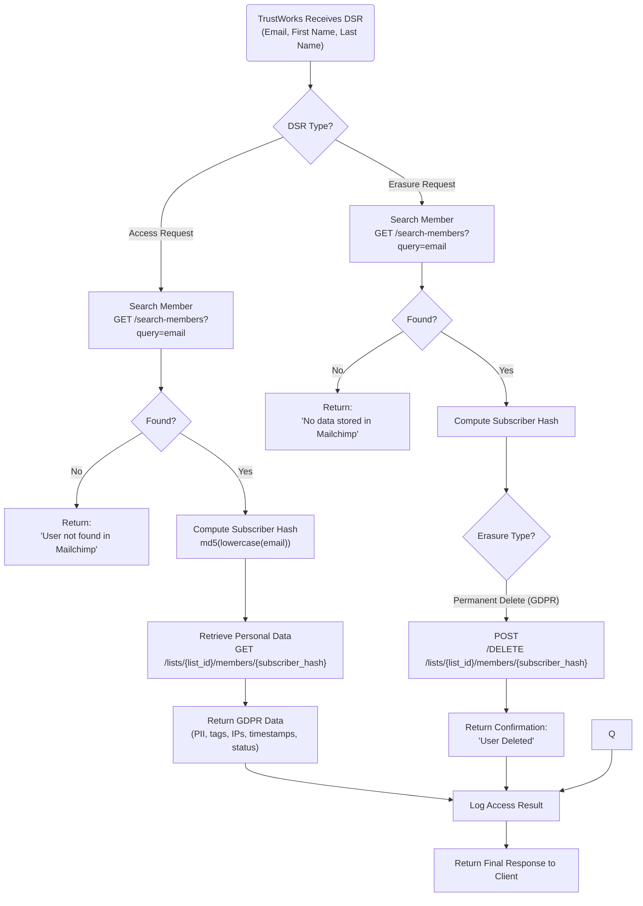

# Mailchimp API Documentation

This documentation describes the Mailchimp API endpoints and operations used for Access Request and Erasure Request.

## Table of Contents

- [Overview](#overview)
- [Workflow Diagram](#workflow-diagram)
- [Authentication](#authentication)
- [Base URL](#base-url)
- [Endpoints](#endpoints)
  - [Health Check](#1-health-check)
  - [Count Members](#2-count-members)
  - [Search Members](#3-search-members)
  - [Get Member by Hash](#4-get-member-by-hash)
  - [Delete Member Permanently](#5-delete-member-permanently)
- [Subscriber Hash](#subscriber-hash)
- [Error Handling](#error-handling)
- [Examples](#examples)

## Overview

This API provides functionality to interact with Mailchimp's audience management system, including member search, retrieval, and deletion operations.

## Workflow Diagram



## Authentication

All API requests require HTTP Basic Authentication using:
- **Username**: Your Mailchimp account email
- **Password**: Your Mailchimp API key

**Format**: `curl -u "email:api_key"`

**Example**:
```bash
curl -u "anystring@email.com:<insert something here>"
```

## Base URL

The base URL follows this pattern:
```
https://{dc}.api.mailchimp.com/3.0
```

Where `{dc}` is the data center code (e.g., `us1`, `us2`, `eu1`).

**Example**:
```
https://us1.api.mailchimp.com/3.0
```

## Endpoints

### 1. Health Check

Check if the API is accessible and your credentials are valid.

**Endpoint**: `GET /ping`

**Authentication**: Required

**Parameters**: None

**Response**: Returns API status information

**Example Request**:
```bash
curl -u "anystring@email.com:${MC_API_KEY}" \
  -X GET "https://us1.api.mailchimp.com/3.0/ping" | jq '.'
```

**Example Response**:
```json
{
  "health_status": "Everything's Chimpy!"
}
```

---

### 2. Count Members

Retrieve the total count of members in a specific list.

**Endpoint**: `GET /lists/{list_id}/members`

**Authentication**: Required

**Path Parameters**:
- `list_id` (string, required): The unique identifier for the list

**Query Parameters**:
- `fields` (string, optional): Comma-separated list of fields to return. Use `total_items` to get only the count.

**Example Request**:
```bash
curl -u "anystring@email.com:${MC_API_KEY}" \
  -G "https://us1.api.mailchimp.com/3.0/lists/866bf7f993/members" \
  --data-urlencode "fields=total_items"
```

**Example Response**:
```json
{
  "total_items": 150
}
```

---

### 3. Search Members

Search for members across all lists using email, name, or other criteria.

**Endpoint**: `GET /search-members`

**Authentication**: Required

**Query Parameters**:
- `query` (string, required): The search query (email, first name, last name, etc.)

**Example Request - Search by Email**:
```bash
curl -u "anystring@email.com:${MC_API_KEY}" \
  -G "https://us1.api.mailchimp.com/3.0/search-members" \
  --data-urlencode "query=john.smith@gmail.com" | jq '.'
```

**Example Request - Search by First Name**:
```bash
curl -u "anystring@email.com:${MC_API_KEY}" \
  -G "https://us1.api.mailchimp.com/3.0/search-members" \
  --data-urlencode "query=Maria" | jq '.'
```

**Example Response**:
```json
{
  "exact_matches": {
    "members": [
      {
        "id": "abc123",
        "email_address": "john.smith@gmail.com",
        "full_name": "John Smith",
        "web_id": 123456,
        "email_type": "html",
        "status": "subscribed",
        "list_id": "866bf7f993"
      }
    ],
    "total_items": 1
  },
  "full_search": {
    "members": [],
    "total_items": 0
  }
}
```

**Notes**:
- Returns search results array, may include multiple matches
- Useful when you don't know the list ID or want to search across multiple lists
- Returns both exact matches and full search results

---

### 4. Get Member by Hash

Retrieve specific member information using the subscriber hash.

**Endpoint**: `GET /lists/{list_id}/members/{subscriber_hash}`

**Authentication**: Required

**Path Parameters**:
- `list_id` (string, required): The unique identifier for the list
- `subscriber_hash` (string, required): MD5 hash of the lowercase email address

**Query Parameters**: None (use `-G` flag for GET requests)

**Example Request**:
```bash
curl -u "anystring@email.com:${MC_API_KEY}" \
  -G "https://us1.api.mailchimp.com/3.0/lists/866bf7f993/members/${SUBSCRIBER_HASH}" | jq '.'
```

**Example Response**:
```json
{
  "id": "abc123",
  "email_address": "john.smith@gmail.com",
  "unique_email_id": "def456",
  "web_id": 123456,
  "email_type": "html",
  "status": "subscribed",
  "merge_fields": {
    "FNAME": "John",
    "LNAME": "Smith"
  },
  "stats": {
    "avg_open_rate": 0.25,
    "avg_click_rate": 0.10
  },
  "ip_signup": "192.168.1.1",
  "timestamp_signup": "2023-01-15T10:30:00+00:00",
  "ip_opt": "192.168.1.1",
  "timestamp_opt": "2023-01-15T10:30:00+00:00",
  "member_rating": 2,
  "last_changed": "2023-01-20T15:45:00+00:00",
  "language": "en",
  "vip": false,
  "email_client": "Gmail",
  "location": {
    "latitude": 40.7128,
    "longitude": -74.0060,
    "gmtoff": -5,
    "dstoff": -4,
    "country_code": "US",
    "timezone": "America/New_York"
  },
  "source": "API",
  "tags_count": 2,
  "tags": [
    {
      "id": 123,
      "name": "Customer"
    }
  ],
  "list_id": "866bf7f993"
}
```

**Advantages**:
- Faster than search
- Returns single member object
- Required for UPDATE/DELETE/PATCH operations
- Provides privacy (email not exposed in URL)
- Mailchimp's standard approach

**When to Use**:
- You know the list ID and want direct, efficient lookup
- You need to perform update or delete operations

---

### 5. Delete Member Permanently

Permanently delete a member from a list. **This action is irreversible.**

**Endpoint**: `POST /lists/{list_id}/members/{subscriber_hash}/actions/delete-permanent`

**Authentication**: Required

**HTTP Method**: `POST` (not GET)

**Path Parameters**:
- `list_id` (string, required): The unique identifier for the list
- `subscriber_hash` (string, required): MD5 hash of the lowercase email address

**Request Body**: None

**Example Request**:
```bash
curl -X POST \
  -u "anystring@email.com:${MC_API_KEY}" \
  "https://us1.api.mailchimp.com/3.0/lists/866bf7f993/members/${SUBSCRIBER_HASH}/actions/delete-permanent" | jq '.'
```

**Example Response**:
```json
{}
```

**Important Notes**:
- ⚠️ **WARNING**: This action is **IRREVERSIBLE** and will permanently delete all data for this member
- Use `POST` method (do NOT use `-G` flag which is for GET requests)
- Always confirm before executing deletion
- Consider implementing a confirmation step in your application

**Example with Confirmation**:
```bash
read -p "Are you sure you want to PERMANENTLY DELETE this member? (yes/no): " CONFIRM
if [ "$CONFIRM" = "yes" ]; then
  echo "Permanently deleting member with email: ${EMAIL}"
  curl -X POST \
    -u "anystring@email.com:${MC_API_KEY}" \
    "https://us1.api.mailchimp.com/3.0/lists/866bf7f993/members/${SUBSCRIBER_HASH}/actions/delete-permanent" | jq '.'
  echo "Member permanently deleted."
else
  echo "Deletion cancelled."
fi
```

---

## Subscriber Hash

The subscriber hash is a MD5 hash of the lowercase email address. It is required for UPDATE/DELETE/PATCH operations and recommended for GET operations.

### Calculation

**Bash/Shell**:
```bash
SUBSCRIBER_HASH=$(echo -n "$EMAIL" | tr '[:upper:]' '[:lower:]' | openssl dgst -md5 | sed 's/^.* //')
```

**Steps**:
1. Convert email to lowercase
2. Calculate MD5 hash
3. Extract the hash value (remove prefix)

**Example**:
- Email: `John.Smith@Gmail.com`
- Lowercase: `john.smith@gmail.com`
- MD5 Hash: `a1b2c3d4e5f6g7h8i9j0k1l2m3n4o5p6`

**Why Use Subscriber Hash**:
- Privacy: Email address is not exposed in the URL
- Standard: Mailchimp's recommended approach
- Required: Necessary for update and delete operations
- Efficiency: Faster lookups than search

---

## Error Handling

### Common HTTP Status Codes

- `200 OK`: Request successful
- `400 Bad Request`: Invalid request parameters
- `401 Unauthorized`: Invalid or missing authentication
- `404 Not Found`: Resource not found (member, list, etc.)
- `500 Internal Server Error`: Mailchimp server error

### Example Error Response

```json
{
  "type": "http://developer.mailchimp.com/documentation/mailchimp/guides/error-glossary/",
  "title": "Resource Not Found",
  "status": 404,
  "detail": "The requested resource could not be found.",
  "instance": "abc123-def456-ghi789"
}
```

### Best Practices

1. Always check HTTP status codes
2. Handle authentication errors gracefully
3. Validate input before making requests
4. Implement retry logic for transient errors
5. Log errors for debugging

---

## Examples

### Complete Workflow Example

```bash
#!/bin/bash

# Configuration
DC="us1"
BASE_URL="https://${DC}.api.mailchimp.com/3.0"
MC_API_KEY="your-api-key-here"
LIST_ID="your-list-id-here"
EMAIL="user@example.com"

# 1. Health Check
echo "Checking API health..."
curl -u "your-email@example.com:${MC_API_KEY}" \
  -X GET "${BASE_URL}/ping" | jq '.'

# 2. Count Members
echo "Counting members..."
TOTAL_MEMBERS=$(curl -u "your-email@example.com:${MC_API_KEY}" \
  -G "${BASE_URL}/lists/${LIST_ID}/members" \
  --data-urlencode "fields=total_items")
TOTAL_COUNT=$(echo "$TOTAL_MEMBERS" | jq -r '.total_items')
echo "Total Members: $TOTAL_COUNT"

# 3. Calculate Subscriber Hash
SUBSCRIBER_HASH=$(echo -n "$EMAIL" | tr '[:upper:]' '[:lower:]' | openssl dgst -md5 | sed 's/^.* //')
echo "Subscriber Hash: ${SUBSCRIBER_HASH}"

# 4. Get Member Information
echo "Retrieving member information..."
curl -u "your-email@example.com:${MC_API_KEY}" \
  -G "${BASE_URL}/lists/${LIST_ID}/members/${SUBSCRIBER_HASH}" | jq '.'

# 5. Search for Member
echo "Searching for member..."
curl -u "your-email@example.com:${MC_API_KEY}" \
  -G "${BASE_URL}/search-members" \
  --data-urlencode "query=${EMAIL}" | jq '.'
```

### Search Examples

```bash
# Search by email
curl -u "email:api_key" \
  -G "https://us1.api.mailchimp.com/3.0/search-members" \
  --data-urlencode "query=user@example.com"

# Search by first name
curl -u "email:api_key" \
  -G "https://us1.api.mailchimp.com/3.0/search-members" \
  --data-urlencode "query=John"

# Search by last name
curl -u "email:api_key" \
  -G "https://us1.api.mailchimp.com/3.0/search-members" \
  --data-urlencode "query=Smith"
```

---

## Additional Resources

- [Mailchimp API Documentation](https://mailchimp.com/developer/api/)
- [Mailchimp API Reference](https://mailchimp.com/developer/marketing/api/)
- [Mailchimp Error Glossary](https://mailchimp.com/developer/marketing/docs/errors/)

---

## Notes

- Email addresses are case-insensitive for hashing purposes
- The API uses RESTful conventions
- Rate limits may apply (check Mailchimp documentation for current limits)
- Always use HTTPS for API requests
- Keep your API key secure and never commit it to version control

---

**API Version**: Mailchimp API 3.0

